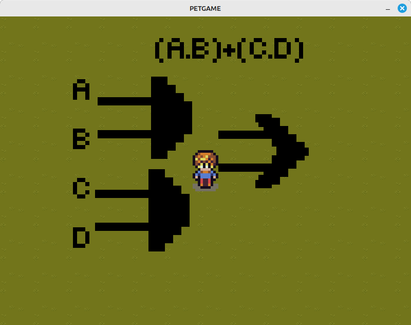

# PET-GAME

Jogo 8-bit educativo sobre circuitos digitais, criado para ensinar de forma interativa os conceitos introdutórios da matéria: portas lógicas, operações binárias e álgebra booleana.

<!-- 📸 Substitua o link abaixo por uma imagem ou GIF mostrando a aplicação em uso -->
<p align="center">
  
</p>

## Sobre o projeto

O PET-GAME nasceu como um projeto ligado ao PET (Programa de Educação Tutorial), com o objetivo de tornar o aprendizado de Circuitos Digitais mais acessível e divertido. Através de uma estética 8-bit, o jogador vai passando por desafios que reforçam conceitos como portas lógicas (AND, OR, NOT, XOR...), operações binárias e álgebra booleana.

## Funcionalidades

- Desafios interativos sobre portas lógicas
- Exercícios de operações e conversões binárias
- Progressão por fases, no estilo de jogos 8-bit clássicos

## Tecnologias utilizadas

<!-- Ajuste conforme a stack real do projeto -->
| Camada | Tecnologia |
|---|---|
| Linguagem | LUA |
| Framework | LOVE2D |

## Como executar

```bash
# clone o repositório
git clone https://github.com/rafaklugee/PET-GAME.git
cd PET-GAME
love .

# é necessário ter o framework LOVE2D instalado
```

## Estrutura do projeto

```
PET-GAME/
├── libraries/    # bibliotecas utilizadas no projeto
├── maps/         # mapas do jogo
├── sounds/       # efeitos sonoros e trilha sonora
├── sprites/      # spritesheets e imagens dos personagens/cenário
├── tiled/        # arquivos-fonte do editor Tiled usados na criação dos mapas
├── tmx/          # mapas exportados no formato .tmx
├── Button.lua    # componente de botão/UI reutilizável
└── main.lua      # ponto de entrada do jogo
```

## Contexto acadêmico

Projeto desenvolvido com fins didáticos, relacionado à disciplina de Circuitos Digitais e feito no programa PET (Programa de Educação Tutorial) Computação.
